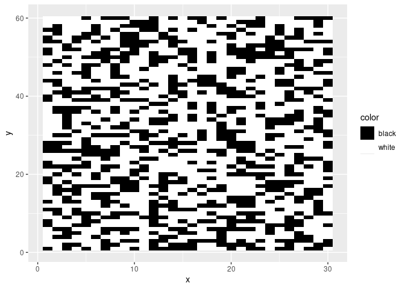
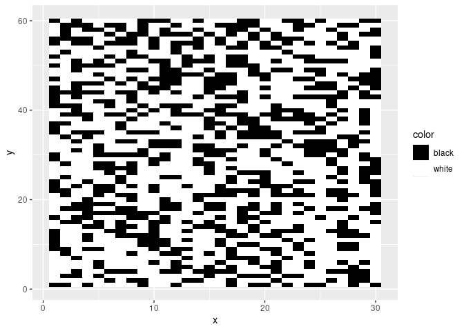
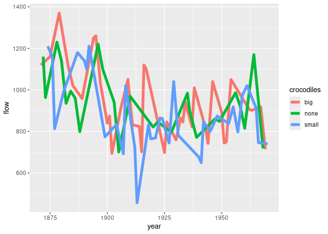
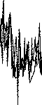
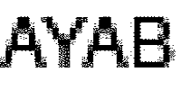

# rayab

The goal of this R package is to provide functionality to create images
suitable for *two-color* **knitting** via the AYAB (all yarns are
beautiful) open source software/ hardware project. Briefly, the goal of
the AYAB project is “to provide an alternative way to control the famous
Brother KH-9xx range of knitting machines using a computer”
(<https://www.ayab-knitting.com>).

Because printing your data visualizations is so last century. In this
century, we knit them using hacked 1970s knitting machines!

rayab includes functions to convert to images suitable for transfer to
the AYAB software:

- ggplot plot objects
- text
- user-supplied images

Not all plots or images are well suited for two-color knitting, so your
mileage may vary.

More information on AYAB can be found here:
(<https://www.ayab-knitting.com>).

# Installation

You can install the development version of rayab from [the r-universe
builds of rayab](https://marioangst.r-universe.dev/rayab) with:

``` r
install.packages('rayab', repos = c('https://marioangst.r-universe.dev', 'https://cloud.r-project.org'))
```

# Basic functionality

``` r
library(rayab)
```

## Converting from ggplot

Say we have a ggplot plot like this one:

``` r
bw_pattern_plot <- make_test_plot()
bw_pattern_plot
```

<!-- -->

rayab can process the plot to a `magick` object in a form more suitable
for printing with AYAB. The workhorse function here is `ggplot_to_ayab`.

``` r
bw_pattern_plot |> 
  ggplot_to_ayab()
```



The default is 60 pixels wide, which can be adjusted (pixels dictate how
wide you knit, every pixel is a stitch). By default, the height is set
based on the original image ratio, but it can also be set.

``` r
bw_pattern_plot |> 
  ggplot_to_ayab(width = 100, height = 30)
```


Let’s take a more complicated plot. Here we have the levels of the river
Nile over a number of years, and the size of crocodiles observed in the
year (I made the last part up).

``` r
nile_plot <-
  make_test_plot_complex_lines()
nile_plot
```

<!-- -->

Let’s transform this one. Oh no, we only get a blank white image!

``` r
nile_plot |> 
  ggplot_to_ayab()
```



This is because the process of turning color images into black and white
is a bit trial and error. rayab has two conversion options to do so:

- “quantize” (the default)
- “threshold”

“quantize” obviously did not work. Let’s try threshold, using the
“bw_method” argument. Yay!

``` r
nile_plot |> 
  ggplot_to_ayab(bw_method = "threshold")
```



## Converting from text

We can also create simple text prints, using `text_to_ayab`:

``` r
text_to_ayab("AYAB", width = 200, height = 100)
```



## Converting images

To convert images, we have to first import them using the `magick`
package. Here, we convert one of the default images included in magick.
Here, we download one of the magick sample images from the web:

``` r
image_to_knit <- magick::image_read("https://jeroen.github.io/images/frink.png")
image_to_knit
```


Now we can convert it with `magick_ayab`:

``` r
image_to_knit |> magick_ayab()
```


# Saving images

To save images, we can use `save_ayab_png` from the created magick
object. For example:

``` r
make_test_plot() |>
  ggplot_to_ayab() |> 
  save_ayab_png(<my-desired-filepath>)
```
